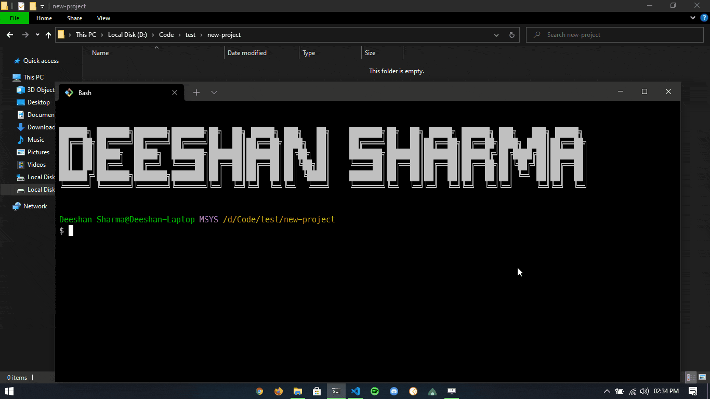

<div align="center">


</div>

<h1 align="center">eslintrc-generator</h1>

 <p align="center">
    A simple CLI tool to create .eslintrc.json file perfectly compatible with your project and code formatter Prettier
    <br />
	Answer some simple questions and get your RC file as well as all the packages installed
    <br />
    <a href="https://www.npmjs.com/package/eslintrc-generator">NPM Package</a>
    ·
    <a href="https://github.com/DeeshanSharma/eslintrc-generator/issues">Report Bug</a>
    ·
    <a href="https://github.com/DeeshanSharma/eslintrc-generator/issues">Request Feature</a>
  </p>

<div align="center">

[](https://www.npmjs.com/package/eslintrc-generator)

[](https://github.com/DeeshanSharma/eslintrc-generator/issues)
[](https://github.com/DeeshanSharma/eslintrc-generator/network)
[](https://github.com/DeeshanSharma/eslintrc-generator/stargazers)
[](https://github.com/DeeshanSharma/eslintrc-generator/pulls)
[](https://github.com/DeeshanSharma/eslintrc-generator/blob/main/LICENSE)

</div>

<hr />
<br />

<div align="center">



</div>

<hr />

<p align="center">Eslintrc-Generator is a simple but time-saving command-line tool that will help you setup your eslint, project, and code formatter with all the configuration you want. You just have to answer some really simple questions and this tool will do all the heavy lifting for you creating the file according to config and installing all the packages</p>

## 💡 Features

1. Uses Airbnb Style Guide
1. Perfectly compatible with
   - TypeScript
   - JavaScript
   - Prettier
   - React
1. Ask questions and creates config based on your choice
1. You have complete control over the configuration
1. Checks for package.json file and `npm init -y` if not found
1. Installs all required packages as dev dependency as per the config
1. Uses your preferred package manager

## ⛏️ Built with

- Inquirer
- Listr
- Execa

## 🏁 Getting Started

Follow all these instructions and learn the best way to take benefits from this package.

### 📚 Prerequisite

- Node
- npm/yarn

### 🧰 Installation

1. Global installation (preferred way)

   ```bash
   npm i eslintrc-generator -g
   ```

   > _**Note:** Global installation is not possible with yarn v2 as far as I know, (please guide me if I am wrong). If you are using yarn v1 then use `yarn global add eslintrc-generator`. But I recommend using the global method_

1. Per project installation

   ```bash
   npm i eslintrc-generator

               or

   yarn add eslintrc-generator
   ```

1. Command to generate RC file

   ```bash
   npx generate-eslintrc

            or

   generate-eslintrc
   ```

## 🎈 Usage

The sole motive of this package is to improve Developer Experience. The package is made to save time configuring **Eslint** and **Prettier**, with your project _(if you have done this before you already know the pain)_. The tool will ask you certain questions, prepare a config and required packages list based on your answers, install all the packages and create the RC file perfectly compatible with your project as well as Prettier. You just need to focus on your awesome project.

## ✍️ Authors

- [@DeeshanSharma](https://www.github.com/DeeshanSharma) - Idea & Initial Work

## 📖 Contributing

**_"In real open source, you have the right to control your own destiny."_** _- Linus Torvalds_

Contributions are what makes the open-source community an amazing place. Any contributions you make are **greatly appreciated**.

## 💳 License

Distributed under the MIT License. See [`LICENSE`](LICENCE) for more information.

## 🧬 Resources

- [Airbnb Style Guide](https://airbnb.io/javascript/)
- [NPM Docs - Creating Node.js modules](https://docs.npmjs.com/creating-node-js-modules)
- [Twilio Guide - How to build a CLI with Node.js](https://www.twilio.com/blog/how-to-build-a-cli-with-node-js)

## 🎉 Acknowledgement

- [Shields.io](https://shields.io)
- [Inquirer.js](https://github.com/SBoudrias/Inquirer.js)
- [Chalk](https://github.com/chalk/chalk)
- [Listr](https://github.com/SamVerschueren/listr)
- [Execa](https://github.com/sindresorhus/execa)
- [Center Align](https://github.com/jonschlinkert/center-align)
- [Figlet.js](https://github.com/patorjk/figlet.js)
- [Clear](https://github.com/bahamas10/node-clear)

## 👋 EndNote

Star this project so you don't miss it when you need it and avoid wasting time Googling the stuff and just focus on the build.
